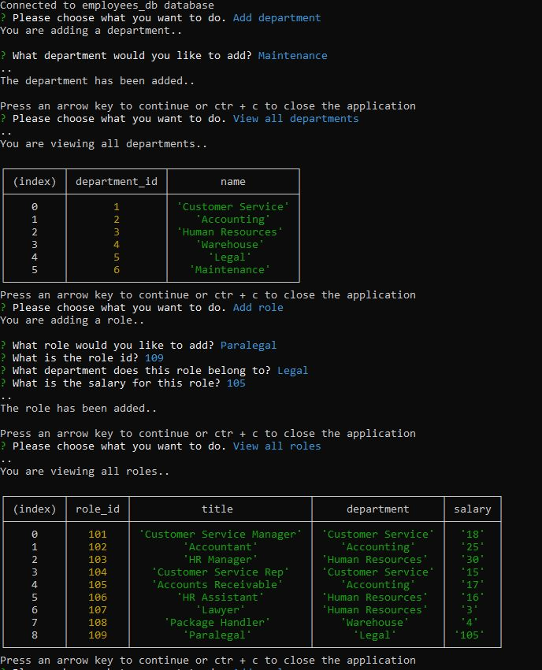

# Employee Tracker

## Description

An application using a SQL database to log and update information about employees. The database starts when the user puts in node server.js and allows the user to browse a menu and select their actions from there.

## Usage

## Link

https://github.com/daestanii1997/employee-tracker

https://drive.google.com/file/d/1cw19xoGMEfwzSwRwJWh1FkNZwhx_qLYx/view
